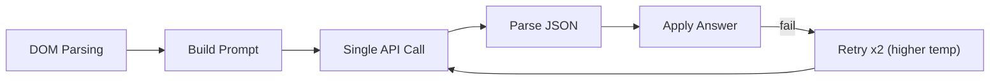
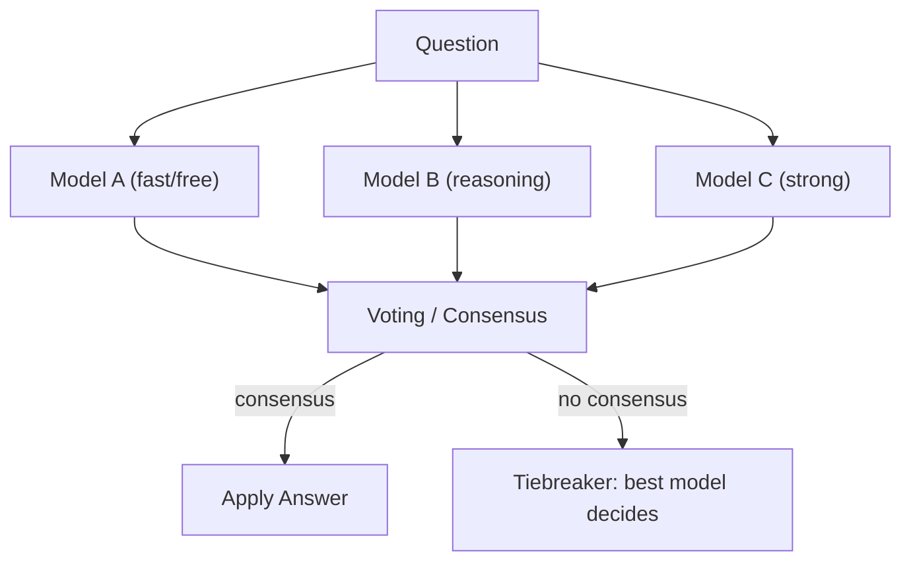
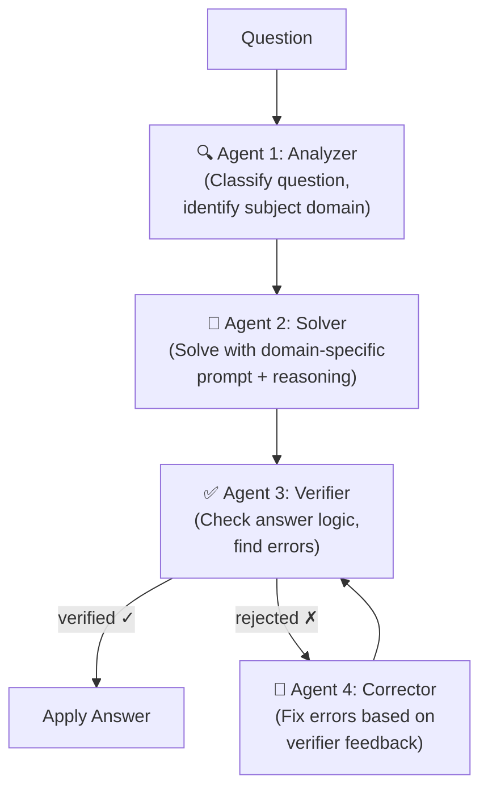
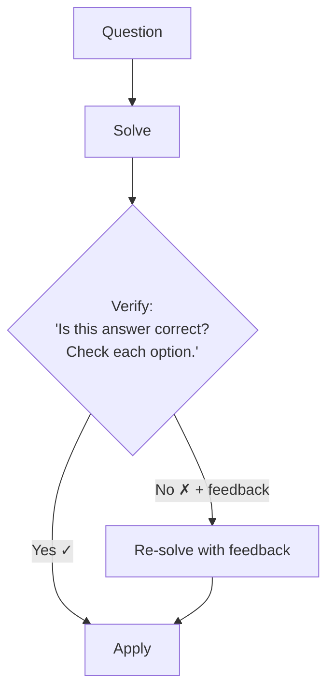
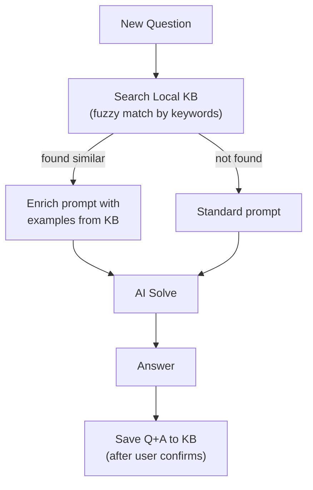
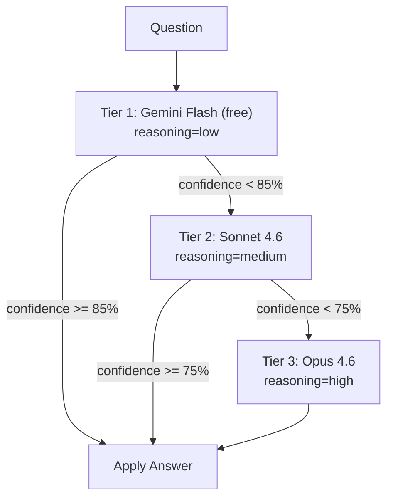
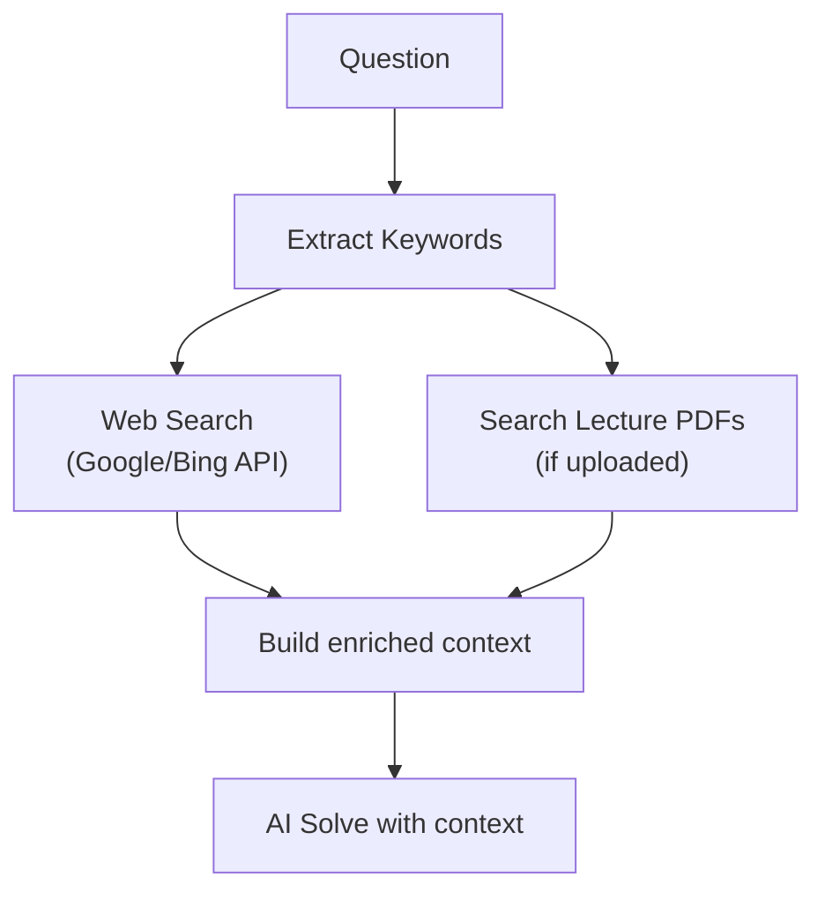
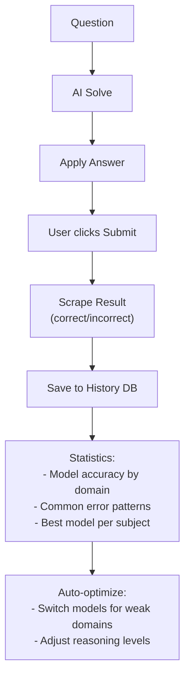

# 🧠 Брейншторм: Повышение качества ответов AI ELIT Solver

## Текущая архитектура

Сейчас система работает по простой цепочке:



**Узкие места текущей системы:**
- Один вызов модели = один шанс получить правильный ответ
- Ретрай меняет только `temperature`, не меняет промпт и не анализирует ошибку
- Нет верификации — ответ принимается "на веру"
- Нет контекста из предыдущих попыток или базы знаний
- Промпты статичные, не адаптируются под конкретный домен вопроса

---

## Стратегия 1: 🏆 Multi-Model Consensus (Голосование нескольких моделей)

**Идея:** Параллельно спрашиваем 2-3 разные модели и выбираем ответ по консенсусу (голосование большинством).



### Варианты реализации:

#### 1a. Simple Majority (простое большинство)
- 3 модели голосуют, берём ответ, который совпал у 2+ из 3
- Если все разные → берём ответ самой "умной" модели

#### 1b. Weighted Voting (взвешенное голосование)
- Каждой модели присваивается вес (на основе её рейтинга/стоимости)
- Opus 4.6 → вес 3, Sonnet 4.6 → вес 2, Gemini Flash → вес 1
- Суммируем веса для каждого варианта ответа

#### 1c. Confidence-Based (по уверенности)
- Просим каждую модель вернуть `confidence: 0-100` в JSON
- Берём ответ с наивысшей уверенностью

### Конфиг в профиле:
```js
// Новое поле в assignment
{
  model: 'primary_model',
  reasoning: 'medium',
  consensus: {
    enabled: true,
    models: ['model_a', 'model_b', 'model_c'],
    strategy: 'majority' | 'weighted' | 'confidence',
    weights: { 'model_a': 3, 'model_b': 2, 'model_c': 1 }
  }
}
```

| ✅ Плюсы | ❌ Минусы |
|-----------|-----------|
| Резко повышает точность (разные модели ошибаются в разных местах) | 2-3x стоимость API вызовов |
| Параллельные запросы → не сильно дольше по времени | Сложность реализации голосования для matching/text |
| Просто понять и отладить | Для free моделей — rate limits |
| Хорошо работает для radio/checkbox | |

> **Сложность реализации: 🟡 Средняя** (2-3 дня)

---

## Стратегия 2: 🤖 Mini-Agent Pipeline (Агентная система)

**Идея:** Цепочка из специализированных "агентов", каждый делает свою работу.



### Агенты:

#### Agent 1: Analyzer (Быстрая дешёвая модель)
- Определяет домен вопроса (математика, программирование, история, право...)
- Определяет сложность (simple / medium / hard)
- Выбирает оптимальную модель и reasoning level для решения
- Генерирует domain-specific подсказки для промпта

#### Agent 2: Solver (Основная модель, подобранная Analyzer'ом)
- Получает обогащённый промпт с domain-specific инструкциями
- Решает задачу с полным reasoning

#### Agent 3: Verifier (Другая модель — для объективности)
- Проверяет логику ответа
- Ищет типичные ошибки (off-by-one, неправильный язык, невнимательность к формулировке)
- Возвращает `{ verified: true/false, issues: [...] }`

#### Agent 4: Corrector (при необходимости)
- Получает оригинальный вопрос + ответ Solver'а + замечания Verifier'а
- Исправляет ответ

### Пример потока:
```
Analyzer: "Это вопрос по C++ программированию, средней сложности. 
           Рекомендую: Sonnet 4.6 + reasoning=medium.
           Hint: обратите внимание на синтаксис указателей."

Solver:   { answer: [2], reasoning: "Вариант 2 правильный потому что..." }

Verifier: { verified: false, issues: ["Solver не учёл, что вопрос 
           спрашивает о C++17, а не C++11. В C++17 structured bindings 
           делают вариант 3 тоже корректным."] }

Corrector: { answer: [2, 3], reasoning: "С учётом C++17..." }
```

| ✅ Плюсы | ❌ Минусы |
|-----------|-----------|
| Максимальное качество — каждый этап проверяет предыдущий | 3-4x стоимость (но Analyzer + Verifier могут быть дешёвыми) |
| Domain-specific промпты = умнее ответы | Значительно дольше по времени (последовательные вызовы) |
| Самокоррекция ошибок | Сложная реализация |
| Масштабируемо — можно добавлять агентов | Overhead для простых вопросов |

> **Сложность реализации: 🔴 Высокая** (4-6 дней)

---

## Стратегия 3: 🔄 Self-Verification Loop (Самопроверка)

**Идея:** После получения ответа, та же или другая модель проверяет его. Легче, чем полная агентная система.



### Реализация:
```js
async function solveWithVerification(formData, modelConfig) {
  // Step 1: Solve
  const answer = await solve(formData, modelConfig);
  
  // Step 2: Verify (can use cheaper model)
  const verification = await verify(formData, answer, verifierConfig);
  
  if (verification.correct) {
    return answer;
  }
  
  // Step 3: Re-solve with verifier's feedback
  return await solveWithFeedback(formData, answer, verification.feedback, modelConfig);
}
```

### Промпт для верификатора:
```
You are a critical reviewer. A student answered this question.
Check if the answer is correct. Consider:
- Is the reasoning logically sound?
- Are there any factual errors?
- Did the student misinterpret the question?
- Are there trick elements in the question they missed?

Respond: {"correct": true/false, "confidence": 0-100, "issues": ["..."]}
```

| ✅ Плюсы | ❌ Минусы |
|-----------|-----------|
| Ловит глупые ошибки (70% ошибок = невнимательность) | 2x стоимость |
| Проще чем полная агентная система | Последовательные вызовы = медленнее |
| Верификатор может быть дешёвой моделью | Верификатор может подтвердить неправильный ответ |
| Естественное расширение текущей архитектуры | |

> **Сложность реализации: 🟢 Низкая** (1-2 дня)

---

## Стратегия 4: 📚 Few-Shot + Knowledge Base (Локальная база знаний)

**Идея:** Собирать правильные ответы в локальную базу. При новых вопросах — искать похожие и вставлять в промпт как few-shot примеры.



### Структура KB (в `chrome.storage.local`):
```js
{
  knowledgeBase: [
    {
      question: "Яка функція використовується для...",
      domain: "programming/cpp",
      answer: [2],
      options: ["printf", "cout", "scanf"],
      confidence: 95,
      verified: true,  // user confirmed it was correct
      timestamp: 1234567890
    }
  ]
}
```

### Как обогащается промпт:
```
Here are examples of similar questions that were answered correctly:

Example 1:
Q: "Який оператор використовується для виведення в C++?"
Options: [0] printf, [1] cout, [2] scanf
Correct: [1] — cout is the C++ standard output stream

Example 2: ...

Now solve the current question using the same reasoning pattern:
```

| ✅ Плюсы | ❌ Минусы |
|-----------|-----------|
| Ноль дополнительных API вызовов | Нужно накопить базу (cold start problem) |
| Модель "учится" на реальных примерах курса | Занимает место в storage |
| Персонализация под конкретный предмет | Нужна UI для управления KB |
| Few-shot доказано повышает качество | Fuzzy search в JS — не идеален |

> **Сложность реализации: 🟡 Средняя** (2-3 дня)

---

## Стратегия 5: 📊 Confidence Cascade (Каскад по уверенности)

**Идея:** Начинаем с дешёвой/быстрой модели. Если она неуверена — эскалируем на более мощную.



### Конфигурация каскада:
```js
cascade: {
  enabled: true,
  tiers: [
    { model: 'google/gemini-3-flash-preview', reasoning: 'low', minConfidence: 85 },
    { model: 'anthropic/claude-sonnet-4.6', reasoning: 'medium', minConfidence: 75 },
    { model: 'anthropic/claude-opus-4.6', reasoning: 'high', minConfidence: 0 },
  ]
}
```

### Модифицированный промпт (добавляем confidence):
```
Respond with:
{"reasoning": "...", "answer": [...], "confidence": 85}

confidence: 0-100, where:
- 95-100: Absolutely certain, textbook knowledge
- 80-94: Very confident, minor uncertainty
- 60-79: Somewhat confident, could be wrong
- 0-59: Guessing, uncertain
```

| ✅ Плюсы | ❌ Минусы |
|-----------|-----------|
| Экономит деньги — дорогие модели только для сложных вопросов | Модели плохо калибруют confidence (часто завышают) |
| Быстро для простых вопросов | Дополнительная латентность при эскалации |
| Прозрачная логика | Нужна эмпирическая настройка порогов |

> **Сложность реализации: 🟢 Низкая** (1-2 дня)

---

## Стратегия 6: 🌐 Context Enrichment (Обогащение контекста)

**Идея:** Перед отправкой вопроса модели — ищем дополнительный контекст (лекции, учебник, Википедия).



### Вариант без внешнего API:
Вместо реального веб-поиска — используем сам LLM как "базу знаний":
```
Step 1 (Retrieval): "Based on this question about C++ templates, 
provide a brief summary of the relevant theory (2-3 paragraphs)."

Step 2 (Solve): "Using the theory above, now answer the question..."
```

Это по сути **Chain-of-Thought с принудительной генерацией контекста** — дёшево и работает.

| ✅ Плюсы | ❌ Минусы |
|-----------|-----------|
| Модель получает релевантный контекст | Веб-поиск = доп. API + латентность |
| Снижает галлюцинации | Без внешнего API — контекст из модели может быть неточным |
| Хорошо для специфических предметов | Увеличивает tokens → стоимость |

> **Сложность реализации: 🟡 Средняя** (Self-Retrieval вариант: 🟢 Низкая)

---

## Стратегия 7: 📈 Answer History + Learning Loop

**Идея:** Трекать результаты (правильно/неправильно) и использовать эту статистику.



### Что собираем:
```js
{
  history: [
    {
      question: "...",
      domain: "math",
      model: "gemini-flash",
      answer: [1],
      correct: true,  // scraped from result page
      timestamp: 1234567890
    }
  ],
  stats: {
    "gemini-flash": { total: 100, correct: 87, accuracy: 0.87 },
    "sonnet-4.6":   { total: 50,  correct: 46, accuracy: 0.92 },
  }
}
```

| ✅ Плюсы | ❌ Минусы |
|-----------|-----------|
| Data-driven оптимизация | Нужно парсить результаты (может быть хрупко) |
| Автоматический выбор лучшей модели | Накопление данных требует времени |
| Ценная статистика для пользователя | Сложная UI для просмотра статистики |

> **Сложность реализации: 🔴 Высокая** (3-5 дней)

---

## 🎯 Рекомендуемый план

Я бы предложил реализовать стратегии **в таком порядке** (от максимального импакта при минимальных усилиях):

### Phase 1 — Quick Wins (1-3 дня)
1. **Self-Verification Loop** (Стратегия 3) — простая проверка ответа второй моделью. Это сразу ловит ~50% ошибок по невнимательности.
2. **Confidence Cascade** (Стратегия 5) — экономит деньги и автоматически эскалирует сложные вопросы.

### Phase 2 — Serious Upgrade (3-5 дней)
3. **Multi-Model Consensus** (Стратегия 1) — для критически важных тестов. Можно сделать как опцию в профиле ("Ultra" профиль).
4. **Few-Shot KB** (Стратегия 4) — начать собирать базу правильных ответов.

### Phase 3 — Full Agent System (5-7 дней)
5. **Mini-Agent Pipeline** (Стратегия 2) — полноценная агентная система с Analyzer → Solver → Verifier → Corrector.

> [!IMPORTANT]
> **Какие стратегии тебя интересуют больше всего?** Я могу начать реализацию любой из них или комбинации. 
> 
> Мой рекомендуемый "best bang for buck": **Self-Verification (3) + Consensus для сложных вопросов (1b)** — это даст ~20-30% прирост точности при разумных затратах.

> [!NOTE]
> Все стратегии можно комбинировать друг с другом и делать их **опциональными** в настройках профиля. Пользователь выбирает: "быстро и дёшево" (Lite) или "максимальная точность" (Ultra).

## Open Questions

1. **Бюджет:** Есть ли ограничения по стоимости API вызовов? Это влияет на выбор между consensus и cascade.
2. **Скорость:** Насколько критично время ответа? Агентная система может занять 15-30 секунд, consensus — 5-10 секунд.
3. **Free модели:** Планируешь ли использовать в основном бесплатные модели? Тогда consensus + cascade — лучший выбор, так как free модели чаще ошибаются, но их можно запускать параллельно без затрат.
4. **Скрапинг результатов:** Есть ли на сайте ELIT страница с результатами, где видно правильно/неправильно ответил? Это открывает Стратегию 7.
